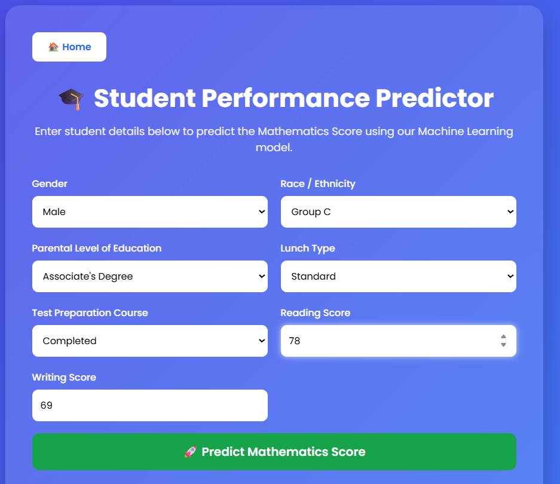

# 🎓 Student Performance Indicator


[](https://student-performance-indicator-end-to-end-b9rf.onrender.com)

An **End-to-End Machine Learning Web Application** that predicts a student's **Mathematics Score** based on demographic and academic information. The project demonstrates the complete machine learning lifecycle—from data preprocessing and model training to deployment using **Flask** and **Render**.

---

## 🌐 Live Demo

🔗 https://student-performance-indicator-end-to-end-b9rf.onrender.com

---

## 📂 GitHub Repository

🔗 https://github.com/Shrirang45/Student-Performance-Indicator-End-to-End-project-

---

# 📖 Project Overview

Student performance is influenced by multiple demographic and educational factors. This project predicts a student's **Mathematics Score** using machine learning models trained on academic and demographic data.

The application demonstrates a complete production-style machine learning workflow including:

- Exploratory Data Analysis (EDA)
- Feature Engineering
- Data Ingestion
- Data Transformation
- Model Training
- Hyperparameter Tuning
- Prediction Pipeline
- Flask Web Application
- Cloud Deployment

---

# ✨ Features

- 📊 Exploratory Data Analysis
- 🔄 Data Preprocessing Pipeline
- 🤖 Multiple Regression Models
- ⚡ Hyperparameter Tuning
- 💾 Model Serialization
- 🌐 Flask Web Interface
- 🚀 Live Deployment on Render
- 📦 Modular Project Structure
- 📝 Custom Logging & Exception Handling

---
---

# 🖼️ Application Preview

## 🏠 Landing Page


---

## 📝 Prediction Page



---

## 📊 Prediction Result


---

# 📊 Dataset

The dataset contains the following student attributes:

| Feature | Type |
|----------|------|
| Gender | Categorical |
| Race/Ethnicity | Categorical |
| Parental Level of Education | Categorical |
| Lunch Type | Categorical |
| Test Preparation Course | Categorical |
| Reading Score | Numerical |
| Writing Score | Numerical |

### 🎯 Target Variable

- Mathematics Score

---

# 📁 Project Structure

```text
Student-Performance-Indicator/
│
├── artifacts/
│   ├── model.pkl
│   ├── preprocessor.pkl
│   ├── train.csv
│   ├── test.csv
│   └── raw.csv
│
├── notebooks/
│   ├── 1. EDA and Feature Engineering.ipynb
│   ├── 2. Model Training.ipynb
│   └── StudentsPerformance.csv
│
├── src/
│   ├── components/
│   │   ├── data_ingestion.py
│   │   ├── data_transformation.py
│   │   └── model_trainer.py
│   │
│   ├── pipeline/
│   │   └── predict_pipeline.py
│   │
│   ├── logger.py
│   ├── exception.py
│   └── utils.py
│
├── templates/
│   ├── index.html
│   └── home.html
│
├── app.py
├── requirements.txt
├── setup.py
├── README.md
└── .gitignore
```

---

# ⚙️ Machine Learning Workflow

## 1️⃣ Data Ingestion

- Load dataset
- Split into Train and Test datasets
- Save datasets into artifacts folder

Outputs:

- raw.csv
- train.csv
- test.csv

---

## 2️⃣ Data Transformation

The preprocessing pipeline is implemented using **Scikit-Learn Pipelines**.

### Numerical Pipeline

- Missing Value Imputation
- Standard Scaling

### Categorical Pipeline

- Missing Value Imputation
- One Hot Encoding

The preprocessing object is saved as:

```
preprocessor.pkl
```

---

## 3️⃣ Model Training

The following regression models were trained and compared:

- Linear Regression
- Decision Tree Regressor
- Random Forest Regressor
- Gradient Boosting Regressor
- AdaBoost Regressor
- KNeighbors Regressor
- XGBoost Regressor
- CatBoost Regressor

Hyperparameter tuning was performed using **GridSearchCV**.

The best-performing model is saved as:

```
model.pkl
```

---

## 4️⃣ Prediction Pipeline

The prediction pipeline:

- Loads the trained model
- Loads the preprocessing object
- Transforms user input
- Predicts Mathematics Score
- Displays prediction on the web application

---

# 📈 Model Evaluation

Evaluation Metrics Used:

- R² Score
- Mean Absolute Error (MAE)
- Mean Squared Error (MSE)
- Root Mean Squared Error (RMSE)

The model with the highest R² score is selected automatically for deployment.

---

# 🌐 Web Application

The Flask application allows users to:

- Enter student details
- Predict Mathematics Score
- View prediction instantly

---

# 🛠️ Technologies Used

### Programming

- Python

### Data Analysis

- Pandas
- NumPy

### Machine Learning

- Scikit-Learn
- XGBoost
- CatBoost

### Visualization

- Matplotlib
- Seaborn

### Backend

- Flask

### Deployment

- Gunicorn
- Render

### Version Control

- Git
- GitHub

---

# 🚀 Installation

### Clone Repository

```bash
git clone https://github.com/Shrirang45/YOUR_GITHUB_REPO.git
```

---

### Navigate to Project

```bash
cd YOUR_GITHUB_REPO
```

---

### Create Virtual Environment

```bash
python -m venv venv
```

---

### Activate Environment

#### Windows

```bash
venv\Scripts\activate
```

#### Linux/macOS

```bash
source venv/bin/activate
```

---

### Install Dependencies

```bash
pip install -r requirements.txt
```

---

### Run Application

```bash
python app.py
```

Visit:

```
http://127.0.0.1:5000
```

---

# 🌍 Deployment

The application is deployed using **Render**.

### Build Command

```bash
pip install -r requirements.txt
```

### Start Command

```bash
gunicorn app:app
```

---

# 🔄 Application Workflow

```text
             User
               │
               ▼
      Flask Web Application
               │
               ▼
        Collect User Input
               │
               ▼
        Prediction Pipeline
               │
               ▼
      Data Preprocessing
               │
               ▼
       Trained ML Model
               │
               ▼
   Predicted Mathematics Score
               │
               ▼
        Display Prediction
```

# 👨‍💻 Author

**Shrirang Ambure**

🎓 B.Tech – Artificial Intelligence & Data Science

GitHub: https://github.com/Shrirang45

LinkedIn: *(Add your LinkedIn Profile)*

---

# ⭐ Support

If you found this project useful, consider giving this repository a **⭐ Star** on GitHub.

It motivates me to build more open-source projects.
